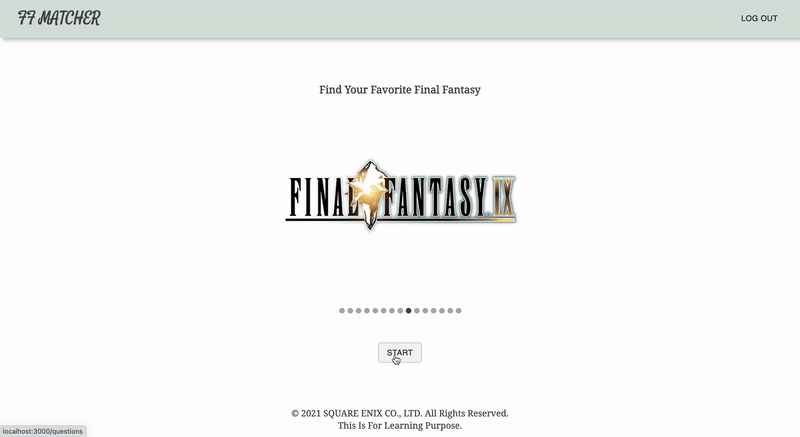

# FF Matcher

This is a fullstack application that you can find your favorite Final Fantasy series by just answering a few questions! Node.js is used for the authentication and mongoDB is used for storeing data.

You have signup or login to play this game.

### Features

- Authentication
- Store questions and results data to MongoDB

### Tech Stack

React, Redux, Node.js, Express.js, MongoDB, Material UI, aws

### Website

Check the website: [DEMO](https://ff-matcher.onrender.com/)
